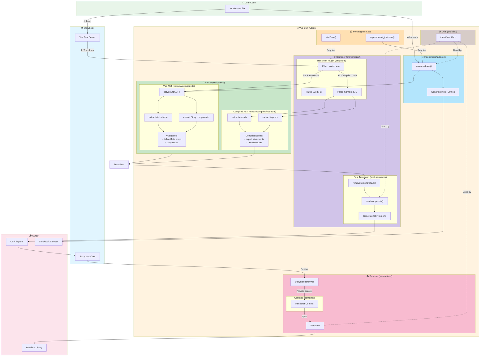
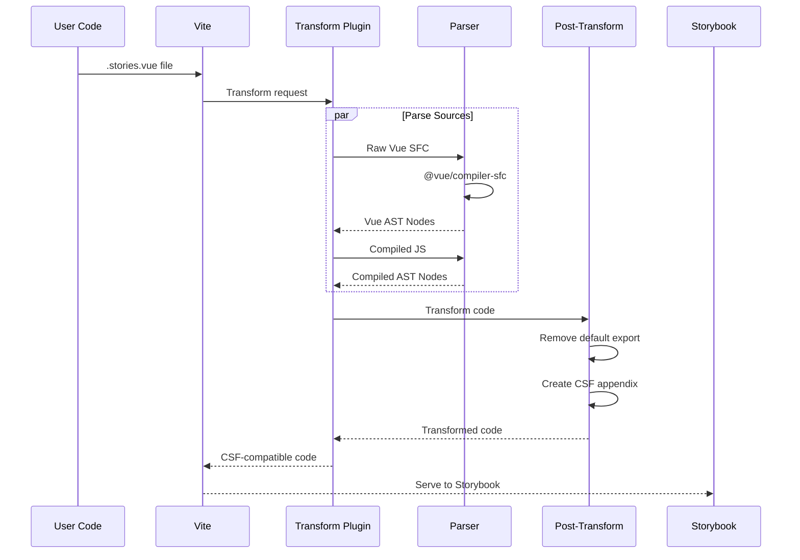
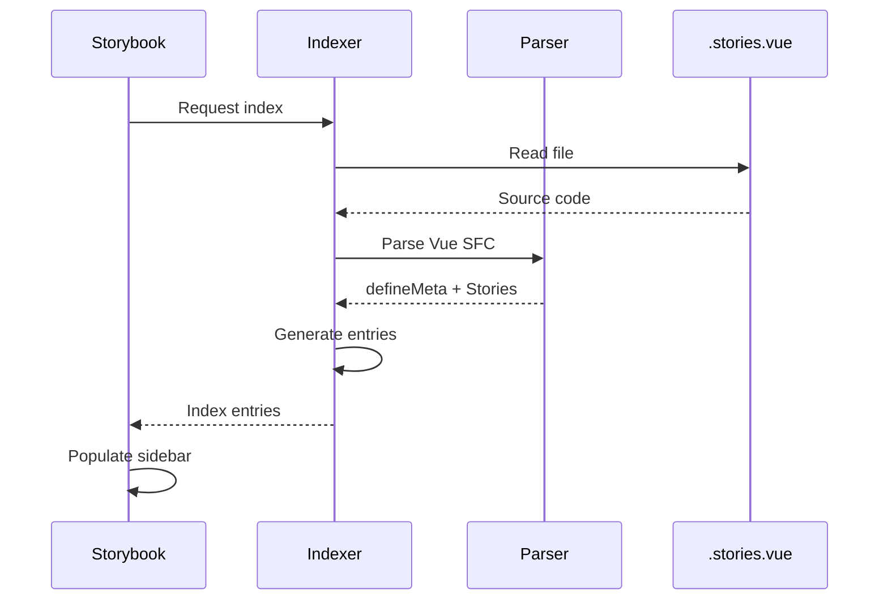
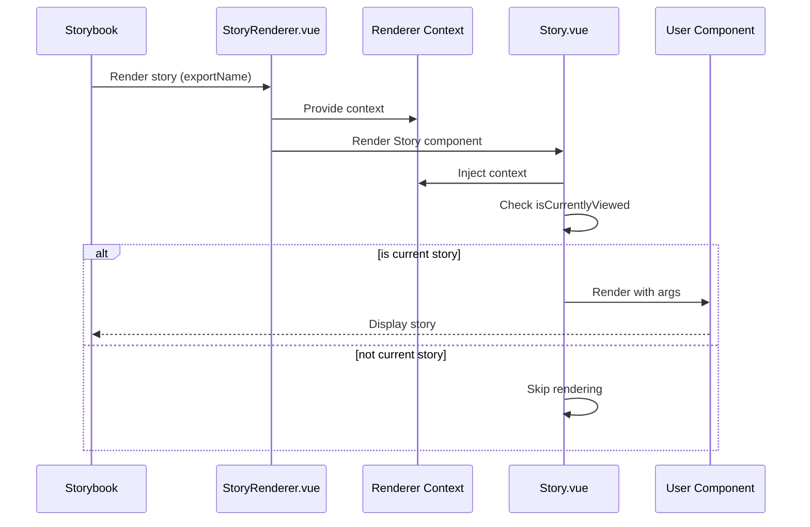

# Vue CSF Addon Architecture

## Overview

This diagram illustrates the complete architecture of the Storybook Vue CSF addon, showing how `.stories.vue` files are processed and rendered.

## Architecture Diagram



## Data Flow

### 1. Build/Development Flow



### 2. Indexing Flow



### 3. Runtime Rendering Flow



## Key Components

### Parser Layer
- **Vue AST Extraction** (`extract/vue/nodes.ts`): Parses `.stories.vue` files using `@vue/compiler-sfc` to extract `defineMeta()` calls and `<Story>` components
- **Compiled AST Extraction** (`extract/compiled/nodes.ts`): Analyzes compiled JavaScript to find exports and imports

### Compiler Layer
- **Transform Plugin** (`plugins.ts`): Vite plugin that orchestrates the transformation
- **Post-Transform** (`post-transform/`): 
  - Removes default exports from compiled Vue code
  - Generates CSF-compatible export appendix

### Indexer Layer
- Discovers stories in `.stories.vue` files
- Generates index entries for Storybook's sidebar

### Runtime Layer
- **Story.vue**: Component used in templates to define stories
- **StoryRenderer.vue**: Renders the currently selected story
- **Renderer Context**: Provides story context to child components

## File Structure

```
src/
├── compiler/          # Code transformation
│   ├── plugins.ts
│   └── post-transform/
│       ├── index.ts
│       ├── create-appendix.ts
│       └── remove-export-default.ts
├── parser/            # AST parsing
│   ├── ast.ts
│   └── extract/
│       ├── vue/nodes.ts
│       └── compiled/nodes.ts
├── indexer/           # Story discovery
│   └── index.ts
├── runtime/           # Vue components
│   ├── Story.vue
│   ├── StoryRenderer.vue
│   └── contexts/
│       └── renderer.ts
├── utils/             # Utilities
│   └── identifier-utils.ts
├── preset.ts          # Storybook preset
├── types.ts           # TypeScript types
└── index.ts           # Public API
```
